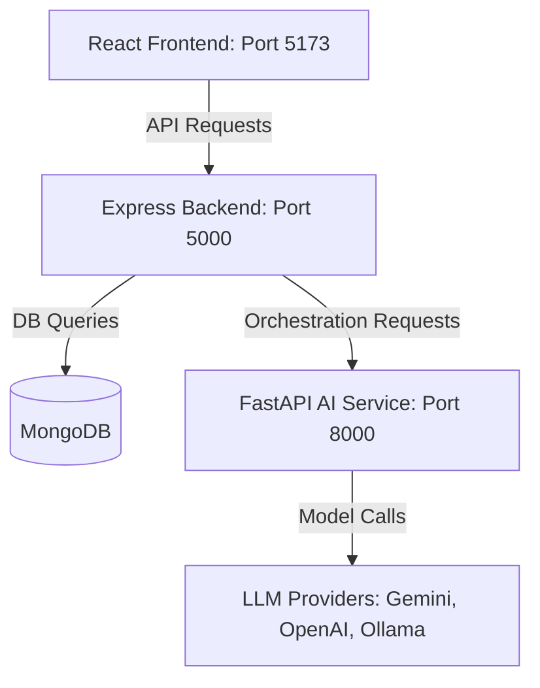

# StudyForge AI Planner 🚀

StudyForge AI Planner is a modern, three-tier educational planning and productivity ecosystem. It leverages a Python multi-agent AI service, a secure Node.js backend, and a highly interactive React frontend to help students orchestrate study roadmaps, generate quizzes from notes, track attendance, complete tasks, and manage spaced-repetitive revision schedules.

---

## 🏗️ Architecture Overview

The system consists of three main services running locally:



1. **Frontend (React + Vite)**: A dynamic, high-performance web dashboard featuring smooth transitions, 3D CSS flips, charts, and clean layouts.
2. **Backend (Express + Node.js)**: The core business logic, user authentication, file uploads (PDF/text summaries), progress analytics, gamification reward logic, and security rate-limiting.
3. **AI Service (FastAPI + LangChain)**: An agentic service containing specialized agents (Planner, Tutor, Weak-Analysis, Revision Scheduler) that orchestrates complex task models using dynamic fallback routing.

---

## 📋 Prerequisites

Before setting up, ensure you have the following installed on your machine:
- **Node.js** (v18 or higher) & **npm**
- **Python** (v3.10 or higher) & **pip** / **venv**
- **MongoDB** (Running locally on `mongodb://localhost:27017` or a MongoDB Atlas URI)

---

## ⚙️ Installation & Setup

Follow these steps to clone, configure, and install all three modules.

### **1. Core Repository & Ignoring Secrets**
Ensure you don't commit private keys. The root `.gitignore` file is pre-configured to ignore all `.env` files, `node_modules`, `__pycache__`, and uploaded static files.

---

### **2. Backend Setup (`/backend`)**

1. Navigate to the backend directory:
   ```bash
   cd backend
   ```
2. Install npm packages:
   ```bash
   npm install
   ```
3. Create a `.env` file in the `backend/` folder:
   ```env
   PORT=5000
   MONGO_URI=mongodb://localhost:27017/studyforge
   JWT_SECRET=your_super_secure_jwt_secret_here
   AI_SERVICE_URL=http://localhost:8000
   FRONTEND_URL=http://localhost:5173
   ```

---

### **3. AI Service Setup (`/ai-service`)**

1. Navigate to the AI service directory:
   ```bash
   cd ../ai-service
   ```
2. Create and activate a virtual environment:
   - **Windows (PowerShell/CMD)**:
     ```powershell
     python -m venv venv
     .\venv\Scripts\activate
     ```
   - **macOS/Linux**:
     ```bash
     python3 -m venv venv
     source venv/bin/activate
     ```
3. Install dependencies:
   ```bash
   pip install -r requirements.txt
   ```
4. Create a `.env` file in the `ai-service/` folder:
   ```env
   PORT=8000
   # LLM Providers (Configure at least one API Key)
   GEMINI_API_KEY=your_gemini_api_key
   OPENAI_API_KEY=your_openai_api_key
   OPENROUTER_API_KEY=your_openrouter_api_key

   # Provider Settings
   DEFAULT_PROVIDER=gemini # Option: gemini, openai, openrouter, ollama
   COMPLEX_REASONING_PROVIDER=gemini

   # Local Ollama Config (Optional fallback)
   OLLAMA_BASE_URL=http://localhost:11434
   OLLAMA_DEFAULT_MODEL=llama3
   ```

---

### **4. Frontend Setup (`/frontend`)**

1. Navigate to the frontend directory:
   ```bash
   cd ../frontend
   ```
2. Install npm packages:
   ```bash
   npm install
   ```
3. Create a `.env` file in the `frontend/` folder:
   ```env
   VITE_API_URL=http://localhost:5000/api
   ```

---

## 🚀 Running the Services Locally

To run the entire ecosystem, start each service in a separate terminal:

### **Terminal 1: Start Backend**
```bash
cd backend
npm run dev
```
*Runs on [http://localhost:5000](http://localhost:5000)*

### **Terminal 2: Start AI Agent Service**
```bash
cd ai-service
# Make sure your virtual environment (venv) is active!
uvicorn app.main:app --port 8000 --reload
```
*Runs on [http://localhost:8000](http://localhost:8000)*

### **Terminal 3: Start Frontend Client**
```bash
cd frontend
npm run dev
```
*Runs on [http://localhost:5173](http://localhost:5173)*

---

## 🛠️ Folder Structure & Custom Extensions

If you or a colleague want to extend the features further, here is where things live:

### **Frontend (`/frontend/src/`)**
- `pages/`: UI screens (`Planner.jsx`, `Tasks.jsx`, `RevisionSchedule.jsx`, `Analytics.jsx`, `Quiz.jsx`, `NotesUpload.jsx`, `Gamification.jsx`, `Attendance.jsx`).
- `styles/`: Core styling and design elements (dark mode accents, timelines, CSS flips).
- `services/api.js`: Central Axios instance mapping authorization tokens automatically.

### **Backend (`/backend/`)**
- `models/`: Database models containing schema specifications (Mongoose).
- `controllers/`: Request handlers managing endpoints, input handling, and database updates.
- `routes/`: Routing declarations bound to rate limiters (`express-rate-limit`).
- `workflows/`: Multi-step logic sequences executing AI integration.
- `integrations/aiService.js`: Network wrapper sending payloads to FastAPI.

### **AI Service (`/ai-service/app/`)**
- `agents/`: Custom agent models implementing `BaseAgent`.
- `models/router.py`: Handles dynamic health checks, rate-limit retries, and fallback logic across AI backends (e.g. falling back from Gemini to local Ollama if offline).
- `prompts/templates.py`: Houses system prompts, formatting rules, and expected response configurations.
- `schemas/ai_schemas.py`: Pydantic JSON templates defining expected LLM formats.

---

## 🔒 Security & Performance Features Built-in
- **Strict Rate Limiting**: Protection against brute-forcing authentication requests (`/api/auth` limited to 15 per 15 minutes) and API abuse (100 requests per 15 minutes globally).
- **Index Support**: Pre-compiled database indexes on the `userId` field across models for fast query lookups.
- **Dynamic Fallbacks**: The Python router dynamically falls back to alternate LLMs/providers if primary engines experience outages or rate limits.
